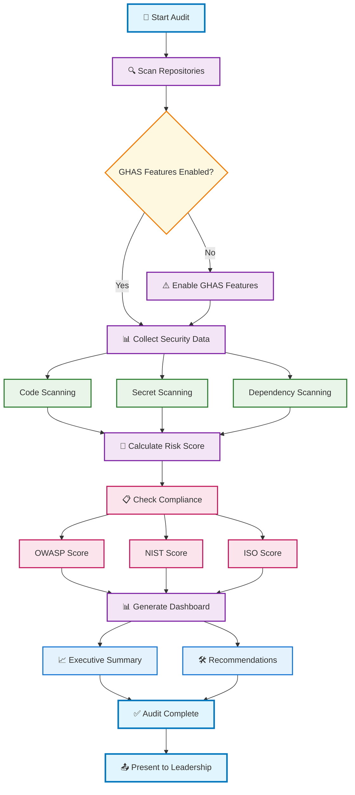

# GHAS Audit Workflow Architecture

## Overview
This diagram illustrates the end-to-end GitHub Advanced Security audit automation workflow for compliance reporting.

## Workflow Diagram

## Module 4 Learning Flow

This simplified workflow focuses on the core learning objectives for conducting a final security audit:

### 🎯 **Phase 1: Discovery & Setup**
- **Start Audit** - Initiate comprehensive security assessment
- **Scan Repositories** - Identify all repositories in scope
- **Check GHAS Features** - Verify security scanning is enabled

### 🔍 **Phase 2: Data Collection**
- **Code Scanning** - Static analysis for vulnerabilities
- **Secret Scanning** - Detect exposed credentials and keys  
- **Dependency Scanning** - Find vulnerable packages and libraries

### 📊 **Phase 3: Risk Assessment**
- **Calculate Risk Score** - Aggregate findings by severity
- **Check Compliance** - Map findings to security frameworks
- **Generate Framework Scores** - OWASP, NIST, ISO compliance ratings

### 📈 **Phase 4: Executive Reporting**
- **Generate Dashboard** - Visual charts and risk matrices
- **Executive Summary** - Business-focused findings overview
- **Recommendations** - Prioritized action items with timelines

### 🎓 **Phase 5: Presentation**
- **Present to Leadership** - Communicate findings and next steps

## Student Learning Checkpoints

✅ **Checkpoint 1**: Successfully enable GHAS features  
✅ **Checkpoint 2**: Collect security data from all three scanning types  
✅ **Checkpoint 3**: Calculate meaningful risk and compliance scores  
✅ **Checkpoint 4**: Generate executive-ready dashboard  
✅ **Checkpoint 5**: Present findings with clear recommendations  

## Color Legend

- 🔵 **Start/End** - Beginning and completion points
- 🟣 **Process** - Core audit activities  
- 🟠 **Decision** - Critical checkpoints requiring action
- 🟢 **GHAS Features** - GitHub Advanced Security capabilities
- 🔴 **Compliance** - Framework alignment activities
- 🔵 **Output** - Reports and deliverables

---

*Last Updated: 2024-01-XX*
*Maintainer: Tim Warner - Pluralsight GHAS Course*
